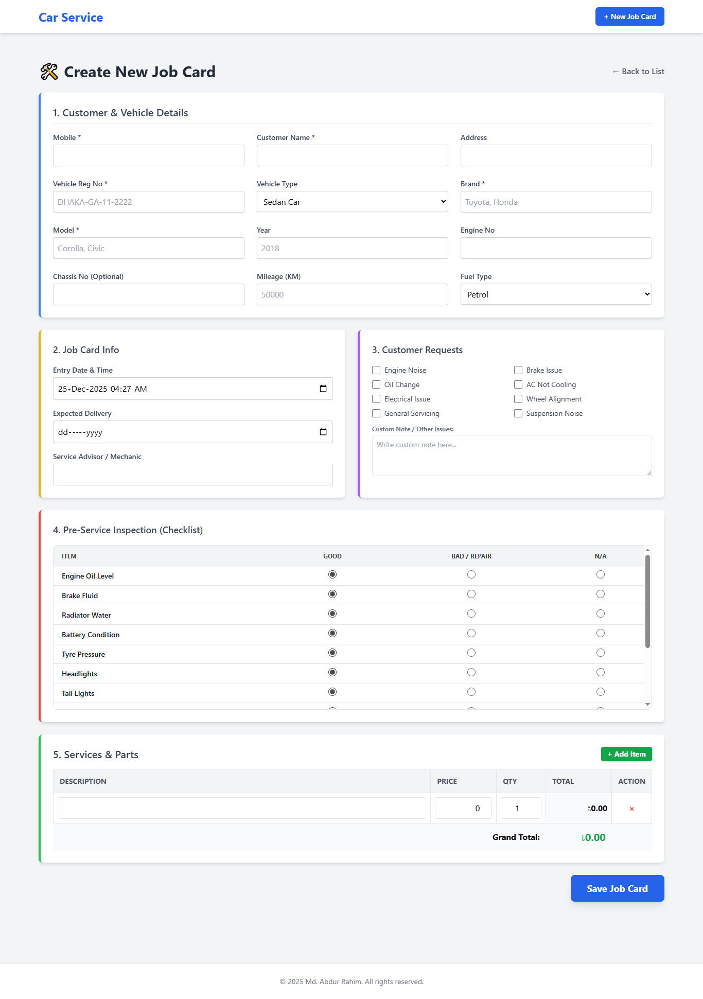
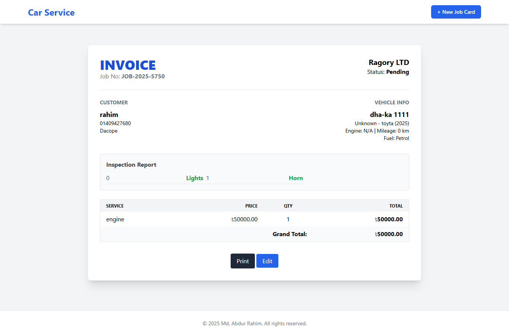
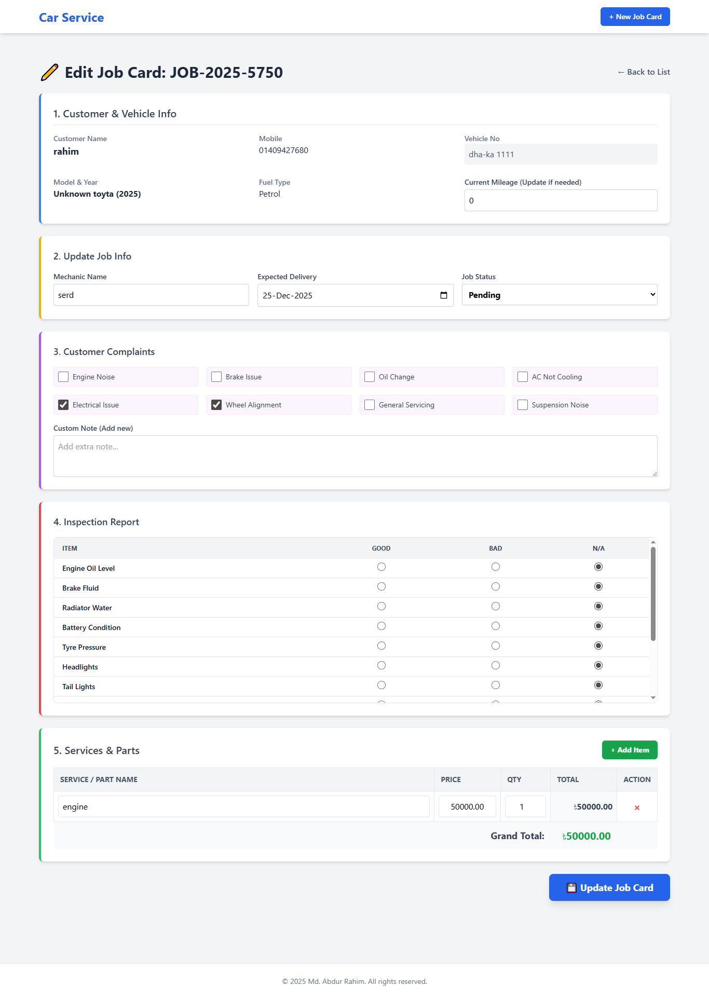

# Dynamic Job Card & Vehicle Servicing Software

A fully dynamic Laravel-based web application for managing vehicle service job cards, customer details, inspection reports, and billing. Developed as an assessment task for the **Laravel Developer Intern** position at **Ragory LTD**.

## Project Overview

This system allows service advisors to creates job cards efficiently. It handles customer and vehicle data relationships, stores inspection checklists using JSON, and calculates service costs dynamically in real-time without page reloads.

##  Key Features

### Job Card Management
- **Auto-Generated Job IDs:** Automatically creates unique IDs (e.g., `JOB-20251025-101`).
- **Dynamic Billing Table:** Add unlimited service parts/labor rows.
- **Real-Time Calculation:** Line totals and Grand totals update instantly using **Alpine.js**.
- **Status Workflow:** Track jobs from `Pending` → `In Progress` → `Completed` → `Delivered`.

###  Customer & Vehicle Tracking
- **Smart Data Handling:** Links Vehicles to Customers automatically via Mobile Number.
- **Detailed Vehicle Info:** Tracks **Engine No**, **Chassis No**, **Mileage**, **Fuel Type**, Model, and Year.
- **Mileage Tracking:** Update vehicle mileage directly during job card creation.

### Technical Implementations
- **JSON Data Storage:** Inspection Checklist (Good/Bad/NA) and Customer Complaints are stored as **JSON** for database efficiency.
- **Sticky Headers:** Tables feature sticky headers for better UX on long lists.
- **No Hardcoding:** All dropdown data (Fuel types, Complaints, Checklist items) comes from the Controller/Configuration, not hardcoded in Views.
- **Printable Invoice:** Clean, professional invoice view ready for printing.

##  Screenshots

| Create Job Card (Dynamic Form) | Invoice View |
|:---:|:---:|
|  |  |

| Job List & Status | Mobile Responsiveness |
|:---:|:---:|
|  |  |

> *Note: Please check the `screenshots` folder for more visuals.*

## 🛠 Tech Stack

- **Framework:** Laravel 10.x
- **Language:** PHP 8.1+
- **Database:** MySQL
- **Frontend:** Blade Templates, Tailwind CSS (CDN)
- **Scripting:** Alpine.js (for dynamic interactions)

##  Installation Guide

Follow these steps to set up the project locally:

### 1. Clone the Repository
```bash
git clone [https://github.com/rahim08717/job-card-system.git](https://github.com/rahim08717/job-card-system.git)
cd job-card-system
